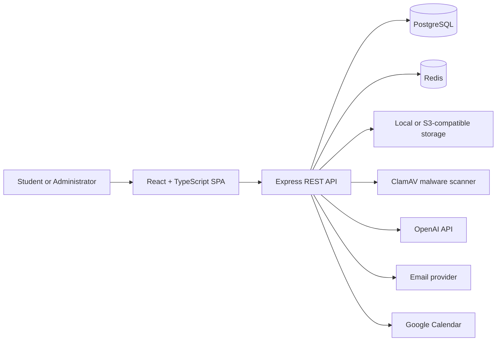

# JomDekan

[](https://github.com/nurinirdnz/Jom-Dekan/actions/workflows/ci.yml)
[](https://www.typescriptlang.org/)
[](https://react.dev/)
[](https://nodejs.org/)
[](https://www.postgresql.org/)

A full-stack academic community platform for Malaysian university students.

JomDekan brings academic resources, discussions, peer tutoring, freelance opportunities, messaging, reporting, and administration into one centralized and accessible platform.

> Portfolio project built with React, TypeScript, Express, PostgreSQL, Redis, and Docker.

---

## Overview

University students often rely on disconnected messaging groups, cloud folders, and social media pages to find academic resources or help from other students.

JomDekan provides a structured platform where students can:

- Share and discover academic resources
- Generate AI-assisted resource summaries
- Ask questions and participate in discussions
- Find tutors and request tutoring sessions
- Browse or publish student freelance opportunities
- Communicate through private messages
- Save favourite content
- Report inappropriate or suspicious activity
- Manage their profile, notifications, and bookings

Administrators receive a dedicated portal for moderation, user management, academic taxonomy, tutoring applications, listings, notifications, analytics, and audit logs.

---

## Key features

### Academic resources

- Upload and browse academic materials
- Filter resources by university, faculty, programme, subject, and category
- Save favourite resources
- Secure file download URLs
- AI-generated summaries and resource Q&A
- Resource reporting and administrative review

### Discussions and communication

- Create and respond to discussion threads
- View complete thread and comment details during moderation
- Private user messaging
- In-app notifications
- Administrative announcements

### Tutoring marketplace

- Apply to become a tutor
- Upload a résumé or CV
- Publish tutoring listings
- Configure subjects, rates, availability, and session mode
- Accept students from other universities or programmes
- Request and manage tutoring bookings
- Administrative tutor and listing review

### Freelance opportunities

- Publish student-focused opportunities
- Specify work details, budgets, skills, and application deadlines
- Submit applications with CV or portfolio files
- Save and report listings
- Administrative listing management

### Administration and moderation

- User administration
- Resource management
- Tutor application review
- Tutoring and freelance listing management
- Full reported-content previews
- Moderation decisions and user responses
- Notifications and announcements
- Audit logging
- Platform analytics
- University, faculty, programme, and subject management

### Accessibility and theming

- Responsive interface
- Light and dark modes
- Theme-aware cards, dialogs, tables, forms, and navigation
- Accessible hover, focus, selected, disabled, error, warning, and success states
- Improved contrast across student and administrator interfaces

---

## Technology stack

| Area                      | Technologies                                         |
| ------------------------- | ---------------------------------------------------- |
| Frontend                  | React 18, TypeScript, Vite, React Router             |
| State and data            | TanStack Query, Zustand, Axios                       |
| Forms and validation      | React Hook Form, Zod                                 |
| Styling                   | Tailwind CSS, custom theme-aware CSS                 |
| Backend                   | Node.js, Express, TypeScript                         |
| Database                  | PostgreSQL 16                                        |
| Caching and rate limiting | Redis 7, in-memory development fallback              |
| Authentication            | JWT access and refresh tokens, secure cookies        |
| File storage              | Local filesystem or S3-compatible storage            |
| Malware scanning          | Configurable ClamAV integration and development stub |
| AI features               | OpenAI API                                           |
| API documentation         | Swagger / OpenAPI                                    |
| Testing                   | Jest, Supertest, Vitest, Testing Library, Playwright |
| Infrastructure            | Docker Compose, GitHub Actions                       |

---

## Architecture



The frontend and backend are independently linted, type-checked, tested, and built by GitHub Actions.

More detail is available in [docs/architecture.md](docs/architecture.md).

---

## Security highlights

JomDekan includes several security controls beyond basic authentication.

### Authentication and authorization

- Password hashing
- Short-lived access tokens
- Refresh-token sessions
- Protected student and administrator routes
- Role-based authorization
- Email verification
- Password reset flow
- Account-level login lockout
- Administrative audit logs

### Rate limiting

- Separate policies for login, registration, refresh, and general API traffic
- Optional Redis-backed counters shared between backend instances
- Automatic in-memory fallback for local development
- Configurable limits and Redis key prefixes

### Upload protection

All supported upload paths—including academic resources, report screenshots, tutor résumés, and opportunity application files—use:

- File-size restrictions
- Actual byte-signature validation
- Content-type verification that does not trust the browser alone
- Centralized malware-scanning policy
- Removal or rejection of infected files
- Configurable ClamAV integration

The default development scanner is a clearly labelled stub and does **not** provide real antivirus protection. Production environments should configure ClamAV and require successful scanning.

Read [SECURITY.md](SECURITY.md) for configuration instructions, limitations, and the security model.

---

## Getting started

### Prerequisites

Install:

- Node.js 22+
- npm
- Docker Desktop
- Git

### Option 1: Run the full stack with Docker

Clone the repository:

```bash
git clone https://github.com/nurinirdnz/Jom-Dekan.git
cd Jom-Dekan
```

Create the root environment file.

macOS or Linux:

```bash
cp .env.docker.example .env
```

Windows PowerShell:

```powershell
Copy-Item .env.docker.example .env
```

Open `.env` and replace the example secrets with secure local values. Then start the application:

```bash
docker compose up --build -d
```

Open:

- Frontend: http://localhost:5173
- Backend: http://localhost:3000
- API documentation: http://localhost:3000/api/v1/docs
- Health check: http://localhost:3000/health

Apply seed data if required:

```bash
docker compose exec backend npm run seed
```

Stop the stack:

```bash
docker compose down
```

### Option 2: Run the application manually

Start PostgreSQL and Redis:

```bash
docker compose up -d postgres redis
```

Set up the backend:

```bash
cd backend
npm install
```

macOS or Linux:

```bash
cp .env.example .env
```

Windows PowerShell:

```powershell
Copy-Item .env.example .env
```

Apply migrations and seed data:

```bash
npm run migrate
npm run seed
npm run dev
```

In another terminal, set up the frontend:

```bash
cd frontend
npm install
```

macOS or Linux:

```bash
cp .env.example .env
```

Windows PowerShell:

```powershell
Copy-Item .env.example .env
```

Start the frontend:

```bash
npm run dev
```

Visit http://localhost:5173.

For the complete setup guide, see [docs/setup.md](docs/setup.md).

---

## Optional ClamAV scanning

Start the ClamAV service:

```bash
docker compose --profile security up -d clamav
```

Configure the backend environment:

```env
MALWARE_SCAN_PROVIDER=clamav
MALWARE_SCAN_REQUIRED=true
CLAMAV_HOST=clamav
CLAMAV_PORT=3310
```

Restart the backend after changing the configuration:

```bash
docker compose restart backend
```

ClamAV can take a few minutes to initialize and download its virus definitions during the first startup.

---

## Available commands

Run commands from the repository root.

| Task                              | Command                                                            |
| --------------------------------- | ------------------------------------------------------------------ |
| Start backend development server  | `npm --prefix backend run dev`                                     |
| Start frontend development server | `npm --prefix frontend run dev`                                    |
| Apply database migrations         | `npm --prefix backend run migrate`                                 |
| Seed development data             | `npm --prefix backend run seed`                                    |
| Create an administrator           | `npm --prefix backend run create-admin -- --email you@example.com` |
| Lint backend                      | `npm --prefix backend run lint`                                    |
| Type-check backend                | `npm --prefix backend run typecheck`                               |
| Test backend                      | `npm --prefix backend test`                                        |
| Build backend                     | `npm --prefix backend run build`                                   |
| Lint frontend                     | `npm --prefix frontend run lint`                                   |
| Type-check frontend               | `npm --prefix frontend run typecheck`                              |
| Test frontend                     | `npm --prefix frontend test`                                       |
| Run frontend E2E tests            | `npm --prefix frontend run test:e2e`                               |
| Build frontend                    | `npm --prefix frontend run build`                                  |

---

## Testing and quality checks

The project uses automated checks for both applications:

### Backend

```bash
npm --prefix backend run lint
npm --prefix backend run typecheck
npm --prefix backend test
npm --prefix backend run build
```

### Frontend

```bash
npm --prefix frontend run lint
npm --prefix frontend run typecheck
npm --prefix frontend test
npm --prefix frontend run build
```

GitHub Actions runs these checks automatically for pull requests and changes to `main`.

The security test suite covers areas such as:

- Rate-limit store selection and fallback behaviour
- Malware-scanner provider behaviour
- Infected and clean upload handling
- File-signature validation
- Resource uploads
- Report evidence
- Tutor résumés
- Opportunity CV and portfolio uploads

---

## Project structure

```text
Jom-Dekan/
├── backend/                 Express and TypeScript REST API
│   ├── scripts/             Migration, seed, and administration scripts
│   ├── src/
│   │   ├── config/          Environment, database, storage, and middleware
│   │   ├── controllers/     HTTP request handlers
│   │   ├── models/          PostgreSQL data access
│   │   ├── routes/          API routes
│   │   ├── services/        Application and integration logic
│   │   ├── types/           Shared backend types
│   │   ├── utils/           Security and general utilities
│   │   └── validators/      Request validation schemas
│   └── tests/               Unit and integration tests
├── database/
│   ├── migrations/          Numbered PostgreSQL migrations
│   ├── schema.sql           Database schema
│   └── seed.sql             Development seed data
├── docs/                    Architecture, API, setup, and design documents
├── frontend/                React and TypeScript application
│   ├── src/
│   │   ├── components/      Reusable interface components
│   │   ├── context/         React contexts
│   │   ├── hooks/           Reusable application hooks
│   │   ├── layouts/         Student and administrator layouts
│   │   ├── pages/           Routed pages
│   │   ├── service/         API clients
│   │   └── types/           Frontend types
│   └── tests/               Component and E2E tests
├── .github/workflows/       Continuous-integration workflows
├── docker-compose.yml       Local application infrastructure
├── README.md
└── SECURITY.md
```

---

## Documentation

| Document                                                       | Description                                       |
| -------------------------------------------------------------- | ------------------------------------------------- |
| [Setup guide](docs/setup.md)                                   | Detailed local setup and configuration            |
| [Architecture](docs/architecture.md)                           | System structure and technical decisions          |
| [API reference](docs/api.md)                                   | REST API overview                                 |
| [Security policy](SECURITY.md)                                 | Security controls, configuration, and limitations |
| [Implementation plan](docs/implementation-plan.md)             | Milestones and implementation status              |
| [Requirements traceability](docs/requirements-traceability.md) | Mapping between requirements and implementation   |
| [Design system](docs/design-system.md)                         | Interface and styling conventions                 |
| [Final design QA](docs/final-design-qa.md)                     | Visual and interaction quality checks             |

---

## Design goals

JomDekan is designed around:

- Clear academic information hierarchy
- Accessible light and dark themes
- Responsive student and administrator workflows
- Reusable components and centralized theme rules
- Secure file handling
- Honest development-versus-production security defaults
- Maintainable TypeScript across the complete stack
- Automated testing and pull-request-based development

---

## Current status

The core student and administrator workflows are implemented and covered by automated checks.

The project is currently intended for local development and portfolio demonstration. Production deployment would additionally require:

- Production-grade secrets management
- HTTPS and secure hosting
- Managed PostgreSQL and Redis
- Real email-provider credentials
- S3-compatible object storage
- Required ClamAV scanning
- Monitoring, alerting, and backups
- Deployment-specific security review

See [docs/implementation-plan.md](docs/implementation-plan.md) for remaining and planned work.

---

## Author

Developed by [nurinirdnz](https://github.com/nurinirdnz) aka Nurin Irdina, Syafiqah Wahidah, Nurul Syafiqah, Nisshaliny and Elly Adriana for Korea-ASEAN Digital Academy - Full Stack Developer Full - Stack Bootcamp.

---

## Contributions

### Nurin Irdina

- Established and maintained JomDekan’s project foundation, development environment, database workflow, Docker configuration, technical documentation, and CI pipeline.
- Integrated and enhanced the team-built authentication and academic taxonomy systems, improving authorization, validation, session behaviour, university-scoped subjects, self-service taxonomy requests, and admin workflows.
- Redesigned major parts of the student portal, including the dashboard, navigation, profile, marketplace, loading states, empty states, responsiveness, and reusable UI components.
- Substantially rebuilt and enhanced the Academic Resources experience, including browsing, filtering, uploading, categories, file previews, resource details, favourites, reporting, and responsive layouts.
- Created the Admin Resources page, including resource inspection, searching, management actions, archive controls, and loading states.
- Built AI-powered resource summaries, multi-file source selection, document processing, generated study materials, and the “Ask This Resource” assistant.
- Developed the reporting system across resources, discussions, comments, users, tutoring listings, and freelance opportunities, including screenshot evidence and report-status handling.
- Substantially enhanced the team-built moderation system with complete reported-content previews, direct content access, decision workflows, response templates, notifications, and clearer administrator review experiences.
- Created the Admin Notifications page and improved the broader team-built notification experience with popovers, unread states, filtering, presentation rules, moderation updates, and administrative announcements.
- Created the initial admin interface for freelance-opportunity management and later improved its workflows, usability, loading states, and dark-mode support.
- Enhanced team-built tutoring with self-service applications, résumé uploads, subject selection, cross-university availability, session modes, contact details, bookings, and improved administrator review.
- Enhanced existing admin analytics, user-management, tutor-application, listing, and audit-log interfaces without claiming ownership of their original implementations.
- Improved audit-log usefulness by reconstructing clearer action details for administrators.
- Built and documented reusable design-system components for cards, forms, controls, status displays, dialogs, navigation, and overlays.
- Implemented and refined platform-wide dark mode and accessibility, correcting contrast, hover, focus, selected, disabled, error, warning, and success states across student and administrator interfaces.
- Strengthened security with Redis-backed rate limiting, file-signature validation, configurable ClamAV scanning, infected-file rejection, secure uploads, and nested storage handling.
- Added orphaned-resource-file detection and improved storage consistency and cleanup.
  Added extensive frontend, backend, AI, notification, moderation, integration, upload-security, and regression tests.
- Fixed TypeScript configuration, merge conflicts, broken CI checks, UI regressions, modal positioning, and cross-feature integration issues.
- Integrated and stabilized teammates’ work across forums, favourites, tutoring, freelance listings, notifications, moderation, analytics, user management, and audit logs through pull-request workflows.

## Repository

[github.com/nurinirdnz/Jom-Dekan](https://github.com/nurinirdnz/Jom-Dekan)
